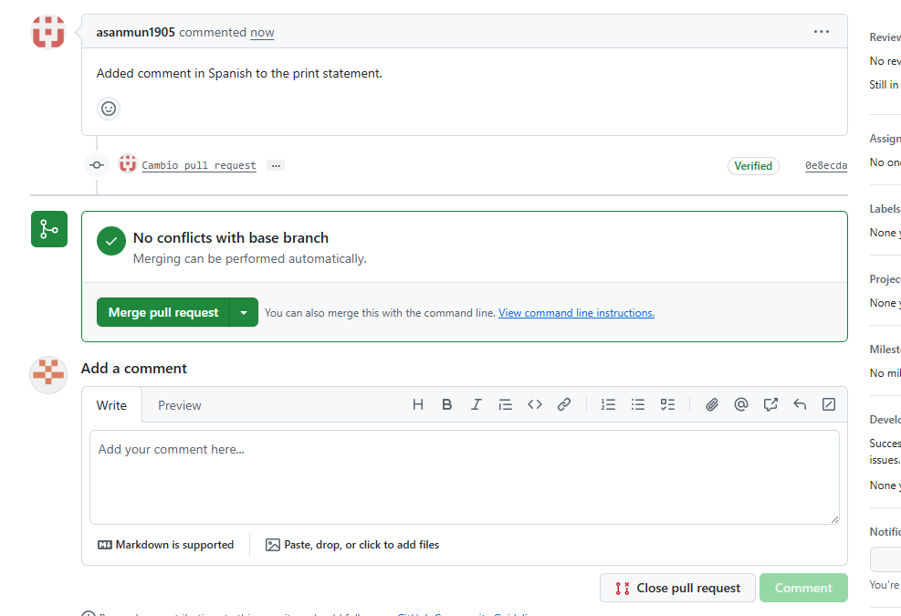

## 🚀 Ejercicio 8

Pull Request en GitHub y Tags de git (por parejas)

1. Una vez hecho el Java nos vamos a la repo de mi compañero y le cambiamos alguna cosilla y se las envio mediante GitHub. Una vez hecho eso el tendría que aceptarnoslo.

# 💙 Bienvenido a mi README
